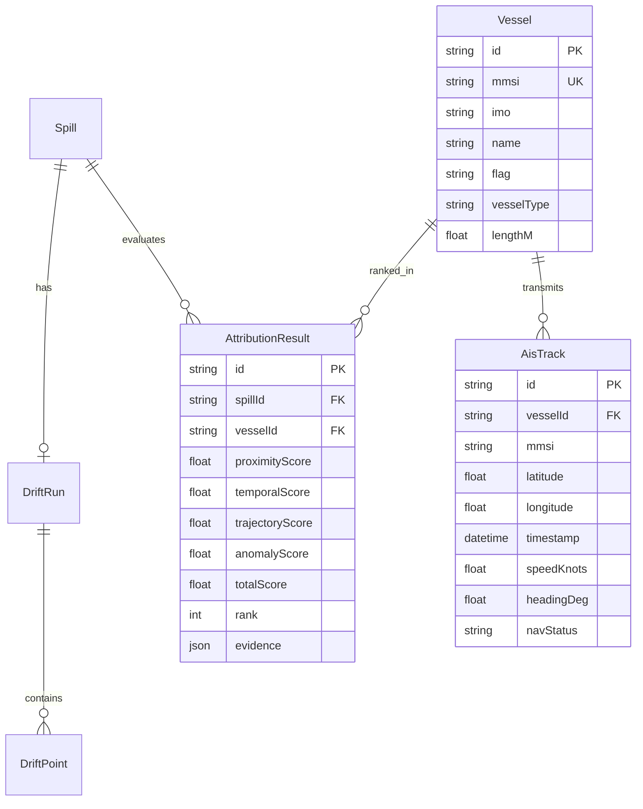

# Phase 4 — AIS Correlation & Candidate Vessel Attribution Report

**Project:** AI-Powered Oil Spill Detection & Vessel Attribution System  
**SIH Problem Statement:** SIH26143  
**Phase:** Phase 4 — AIS Correlation & Vessel Attribution Pipeline  
**Status:** COMPLETE & VERIFIED  

---

## 1. AIS Data Source

In strict compliance with the project scientific data policy, there is no live or real-world commercial AIS receiver network connected in this development environment.

Therefore, an offline, deterministic **Demonstration AIS Dataset** (`source: "demo"`) has been constructed and bundled in the repository:
- **Vessel Metadata File:** [`services/backend-node/src/data/demo-vessels.json`](file:///d:/PROJECTS/Collge%20Project/oil-spill-attribution/services/backend-node/src/data/demo-vessels.json)
- **AIS Tracks File:** [`services/backend-node/src/data/demo-ais-tracks.json`](file:///d:/PROJECTS/Collge%20Project/oil-spill-attribution/services/backend-node/src/data/demo-ais-tracks.json)

Every record is explicitly labelled with `source = "demo"`.

---

## 2. Demonstration Data Limitations & Naming Rules

### Evidentiary Terminology
In adherence to maritime forensic ethics, the following terms are **strictly prohibited**:
- ❌ Responsible Vessel
- ❌ Guilty Vessel
- ❌ Confirmed Polluter
- ❌ Proven Cause

Instead, the system strictly employs:
- ✔️ **Candidate Vessel**
- ✔️ **Attribution Score**
- ✔️ **Modelled Correlation**
- ✔️ **Spatial Evidence**
- ✔️ **Temporal Evidence**
- ✔️ **Trajectory Evidence**

### Synthetic Nature
The AIS points and vessel identities are synthetic test benchmarks designed for pipeline demonstration in the Arabian Sea / Mumbai offshore corridor. They do not represent actual vessel logs or maritime pollution events.

---

## 3. Data Model & Database Architecture

The relational schema in PostgreSQL/Prisma includes:

---

## 4. Spatiotemporal Search Radius & Window

- **Default Search Radius:** `DEFAULT_AIS_SEARCH_RADIUS_KM = 50.0 km`
- **Default Time Window:** `timeWindowHours = 24.0 hours` (evaluates tracks $\pm 24\text{h}$ around the modelled discharge timestamp)
- **Configurability:** Per-analysis override is supported via the attribution service options and API query parameters.

---

## 5. Spatial Proximity Method

Evaluates the minimum great-circle Haversine distance $d_{\min}$ between all vessel track points and the modelled discharge origin $(lat_{\text{orig}}, lng_{\text{orig}})$.

$$\text{proximityScore} = \exp\left(-\frac{d_{\min}}{\lambda_{\text{spatial}}}\right)$$

- **Decay Scale:** $\lambda_{\text{spatial}} = 15.0\text{ km}$ (Demonstration heuristic)
- **Output:** `{ score, minDistanceKm, closestPoint, closestTimestamp }`

---

## 6. Temporal Correlation Method

Evaluates the absolute time delta $\Delta t$ between the vessel's closest point of approach ($t_{\text{passing}}$) and the estimated discharge time ($t_{\text{origin}}$).

$$\text{temporalScore} = \exp\left(-\frac{\Delta t^2}{2 \sigma_{\text{temporal}}^2}\right)$$

- **Gaussian Sigma:** $\sigma_{\text{temporal}} = 3.0\text{ hours}$ (Demonstration heuristic)
- **Output:** `{ score, timeDiffHours, vesselPassingTime, estimatedSpillTime }`

---

## 7. Trajectory Kinematics Method

Evaluates the vessel path alignment and kinematics:
1. **Closest Point of Approach (CPA) Distance:** $d_{\text{CPA}}$
2. **Heading Consistency:** $1 / (1 + \sigma_{\text{heading}} / 30^\circ)$
3. **Speed Consistency:** $1 / (1 + \sigma_{\text{speed}} / 5\text{ kts})$
4. **Time to Origin:** $|t_{\text{CPA}} - t_{\text{origin}}|$

$$\text{trajectoryScore} = 0.50 \cdot \exp\left(-\frac{d_{\text{CPA}}}{20}\right) + 0.25 \cdot \text{headingConsistency} + 0.25 \cdot \text{speedConsistency}$$

*Notice: Speed variations are denoted strictly as "speed anomaly / movement anomaly", not "discharge evidence".*

---

## 8. AIS Anomaly Feature Method

Evaluates telemetry continuity:
1. **AIS Gap Detection:** Reports gaps exceeding expected interval ($>30\text{ min}$).
2. **Speed Drop Detection:** Deceleration $\ge 4.0\text{ knots}$.
3. **Course Change Detection:** Course alterations $\ge 25.0^\circ$.

$$\text{anomalyScore} = \min\left(1.0, 0.10 + w_{\text{gap}} + w_{\text{speed}} + w_{\text{course}}\right)$$

*Notice: AIS transmission gaps and speed drops are exploratory correlation features only and do not constitute proof of deliberate transponder shutoff or illegal discharge.*

---

## 9. Final Attribution Score & Heuristic Weights

The 4 component scores are synthesized using exact heuristic weights:

$$\text{finalScore} = 0.30 \cdot \text{proximityScore} + 0.25 \cdot \text{temporalScore} + 0.25 \cdot \text{trajectoryScore} + 0.20 \cdot \text{anomalyScore}$$

| Component | Weight | Correlation Focus |
|---|---|---|
| **Proximity** | 30% (`0.30`) | Spatial distance to reverse-hindcast origin |
| **Temporal** | 25% (`0.25`) | Time delta to estimated discharge release |
| **Trajectory** | 25% (`0.25`) | Kinematic CPA and route consistency |
| **Anomaly** | 20% (`0.20`) | Telemetry gaps and movement variations |

---

## 10. API Endpoints

The following REST API endpoints are exposed on the Node.js backend:

| Method | Endpoint | Description | Auth Required |
|---|---|---|---|
| `POST` | `/api/v1/attribution/analyze` | Trigger on-demand attribution scoring for a spill | Yes |
| `GET` | `/api/v1/attribution/:analysisId` | Get ranked candidate vessels and evidence dossier | Yes |
| `GET` | `/api/v1/vessels` | List all vessels in the registry | Yes |
| `GET` | `/api/v1/vessels/:mmsi/track` | Get historical AIS track points for a vessel | Yes |
| `GET` | `/api/v1/spills/:id/vessels` | Get ranked vessels for a specific spill | Yes |

---

## 11. Frontend Implementation

The following React web components were updated:
1. **[`VesselRankTable.jsx`](file:///d:/PROJECTS/Collge%20Project/oil-spill-attribution/apps/web/src/components/vessels/VesselRankTable.jsx):**
   - Added persistent amber banner: `"AIS DATA SOURCE: DEMONSTRATION DATASET (SYNTHETIC AIS EVIDENCE)"`
   - Interactive expandable rows revealing 4 score cards (Proximity 30%, Temporal 25%, Trajectory 25%, Anomaly 20%)
   - Full evidence breakdown (Min Distance, Time Difference, Passing Speed/Heading, Max Gap)
   - Mandatory scientific disclaimer at the bottom.
2. **[`VesselDetails.jsx`](file:///d:/PROJECTS/Collge%20Project/oil-spill-attribution/apps/web/src/components/vessels/VesselDetails.jsx):**
   - Candidate Vessel header with rank badge and vessel metadata
   - 4-component score breakdown
   - Minimum Distance, Passing Coordinates, AIS Gaps, and Speed metrics
   - Prominent scientific disclaimer and deep-link to AIS track inspection.
3. **[`VesselLayer.jsx`](file:///d:/PROJECTS/Collge%20Project/oil-spill-attribution/apps/web/src/components/map/VesselLayer.jsx):**
   - Map markers with color coding (Rank 1 candidate in red, others in sky blue)
   - Popup showing Candidate Vessel name, MMSI, Attribution Score %, Distance to Origin, Passing Speed, and demo badge
   - Dotted polyline rendering of the selected candidate's complete 48h AIS track.
4. **[`Analysis.jsx`](file:///d:/PROJECTS/Collge%20Project/oil-spill-attribution/apps/web/src/pages/Analysis.jsx):**
   - Assembles Potential Oil Slick, Modeled Origin, and Candidate Vessels in the analysis workspace.
5. **[`Reports.jsx`](file:///d:/PROJECTS/Collge%20Project/oil-spill-attribution/apps/web/src/pages/Reports.jsx):**
   - Generates and renders comprehensive Investigation Dossiers with full candidate vessel correlation rankings and mandatory scientific disclaimers.

---

## 12. Verification & Test Results

### Node.js Test Suite
- **Command:** `npm test`
- **Results:** 4 test suites passed, 32 unit tests passed (100% pass rate)
  - `haversine.test.js`: 6/6 passed
  - `scoring.test.js`: 19/19 passed
  - `attribution.service.test.js`: 4/4 passed
  - `detection.service.test.js`: 3/3 passed

### Python Test Suite
- **Command:** `pytest tests/`
- **Results:** 31 tests passed, 0 failures (100% pass rate)
  - Detection API, SAR dataset validation, georeferencing, model registry, postprocessing, preprocessing, and U-Net architecture tests all intact.

### End-to-End Simulation Results

Running [`scripts/verify_phase4_e2e.js`](file:///d:/PROJECTS/Collge%20Project/oil-spill-attribution/scripts/verify_phase4_e2e.js) against the Arabian Sea demonstration scenario produced:

| Rank | Candidate Vessel | MMSI | Type | Min Dist | $\Delta t$ | Proximity (30%) | Temporal (25%) | Trajectory (25%) | Anomaly (20%) | **Total Score** |
|---|---|---|---|---|---|---|---|---|---|---|
| **#1** | **DEMO MARINER ALPHA** | 999001001 | Crude Oil Tanker | 2.35 km | 2.0 h | 85.52% | 80.07% | 87.85% | 34.93% | **74.62%** |
| **#2** | **DEMO VOYAGER BETA** | 999002002 | Chemical Tanker | 7.37 km | 0.5 h | 61.19% | 98.62% | 83.87% | 10.00% | **65.98%** |
| **#3** | **DEMO CARRIER GAMMA** | 999003003 | Product Tanker | 6.85 km | 5.5 h | 63.34% | 18.63% | 84.77% | 10.00% | **46.85%** |
| **#4** | **DEMO BULKER DELTA** | 999004004 | Bulk Carrier | 49.63 km | 1.5 h | 3.66% | 88.25% | 54.18% | 10.00% | **38.71%** |

*Note: Container ship `DEMO EXPRESS EPSILON` (>88 km distant) is properly excluded by the 50 km search radius filter.*

---

## 13. Limitations

1. **Synthetic Telemetry:** Telemetry is synthetic and cannot capture natural GPS multipath errors or unpredictable ocean current effects without live sensor feeds.
2. **Heuristic Weights:** The weights (30/25/25/20) and decay constants (15 km, 3 h) are demonstration heuristics and must not be cited as scientifically validated legal proof.
3. **Hydrodynamic Coupling:** PyGNOME integration for hydrodynamic ocean current advection and weathering is part of Phase 5.

---

## 14. Mandatory Scientific & Legal Disclaimer

> **Attribution scores represent modelled spatial, temporal, and trajectory correlations from available AIS and SAR-derived information. They do not establish legal responsibility, causation, or proof of pollution by any vessel.**  
> **AIS records used in this demonstration are synthetic/demo records and do not represent actual historical vessel movements.**
