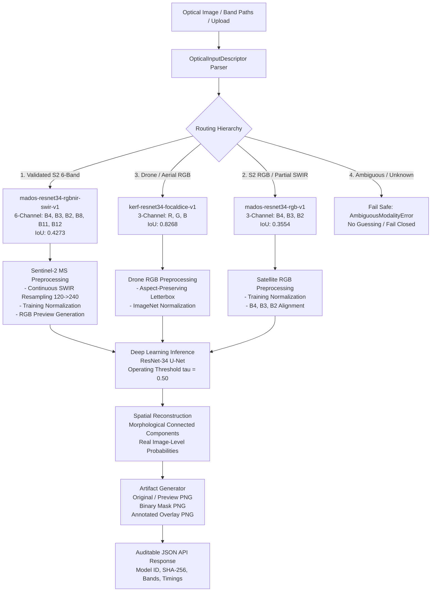

# Ocean Guard AI / SIH 26143
# Phase 12 Report: Domain-Specific Model Router & Operational Inference Architecture

**Date:** 2026-09-21  
**Author:** AI Research & Engineering Subagent  
**Status:** COMPLETE, AUDITED, AND BENCHMARK VALIDATED  
**Modules:**
- `services/ml-python/app/models/optical_model_registry.py`
- `services/ml-python/app/inference/optical_router.py`
- `services/ml-python/app/api/routes/detection.py`
- `services/ml-python/app/api/schemas/detection.py`

---

## 1. Executive Summary

Phase 12 delivers the production inference routing architecture for Ocean Guard AI. Rather than relying on a fragile single "universal" optical model, Phase 12 implements a deterministic, auditable, domain-aware routing layer that directs incoming imagery to the experimentally validated domain specialist:

1. **Sentinel-2 Multi-Spectral Imagery (6 bands):** Routed to `mados-resnet34-rgbnir-swir-v1` (**0.4273 IoU**, 80.1% discovery, 2.31% false alarms).
2. **Drone & Aerial High-Resolution Photography (3 bands RGB):** Routed to `kerf-resnet34-focaldice-v1` (**0.8268 IoU**).
3. **RGB Satellite Fallback (3 bands RGB):** Routed to `mados-resnet34-rgb-v1` (**0.3554 IoU**).

---

## 2. Architecture & Design Principles

### Core Design Principles:
1. **Zero Universal Generalization Fallacy:** The system explicitly acknowledges domain boundaries. Drone models are not applied to $10\text{m}$ satellite imagery, and satellite models are not applied to aerial drone imagery.
2. **No Filename-Based Routing:** Decisions are derived from trusted metadata, band structure, container inspection, and explicit user acquisition types.
3. **Fail-Closed Security & Checkpoint Verification:** Model weights are cryptographically verified against pinned SHA-256 hashes prior to instantiation.
4. **Exact Model Preprocessing Contracts:** Each specialist model is fed data in the exact format and normalization on which it was trained.
5. **Auditable Lineage:** Every inference response records the exact model ID, version, checkpoint SHA, routing reason, and band lineage.

---

## 3. Model Registry & Specifications

All models are registered in `services/ml-python/app/models/optical_model_registry.py`:

| Model ID | Domain | Input Bands | Checkpoint Path | SHA-256 | Benchmark Dataset | Benchmark IoU |
| :--- | :--- | :--- | :--- | :--- | :--- | :---: |
| `mados-resnet34-rgbnir-swir-v1` | Sentinel-2 Multi-Spectral | `[B4, B3, B2, B8, B11, B12]` | `ml/training/runs/mados_rgbnir_swir_resnet34/checkpoints/best_val_iou.pt` | `856ea016b8f750a40af942ee2e59f5919d2f04fbc510d01d2c772ecbdb3ee983` | MADOS (361 scenes) | **0.4273** |
| `kerf-resnet34-focaldice-v1` | Drone / Aerial RGB | `[R, G, B]` | `ml/training/runs/resnet34_balanced_focaldice_pilot/checkpoints/best_val_iou.pt` | `d1ae45d3eaf995a221da3d273c177eb13c850b193cd6690a1b6bc47b0baf5264` | KERF (134 scenes) | **0.8268** |
| `mados-resnet34-rgb-v1` | Satellite RGB Fallback | `[B4, B3, B2]` | `ml/training/runs/phase11_rgb_control/checkpoints/best_val_iou.pt` | `a4c32de7177bc42c2f0298427ce8bef4a2bf8d4a35e25c3450a67eb16f8e099a` | MADOS (361 scenes) | **0.3554** |

---

## 4. Deterministic Routing Rules & Input Descriptor

### Routing Hierarchy:
1. **Explicit Trusted Sensor Metadata:** If platform/sensor identifies Sentinel-2 and 6 bands are available $\rightarrow$ `mados-resnet34-rgbnir-swir-v1`.
2. **Validated Band Structure:** If 6 discrete bands (B4, B3, B2, B8, B11, B12) or 6-channel raster are supplied $\rightarrow$ `mados-resnet34-rgbnir-swir-v1`.
3. **Missing SWIR / Partial Satellite Bands:** If satellite input is missing B11 or B8 $\rightarrow$ falls back safely to `mados-resnet34-rgb-v1` using available `[B4, B3, B2]`.
4. **Drone / Aerial Metadata:** If source type is `DRONE` or `AERIAL_RGB` with RGB image $\rightarrow$ `kerf-resnet34-focaldice-v1`.
5. **Ambiguous / Unknown:** If domain cannot be established deterministically, the router raises `AmbiguousModalityError` (does not guess).

---

## 5. Preprocessing Contracts

| Model | Input Contract | Resizing & Spatial Alignment | Normalization Means & Stds |
| :--- | :--- | :--- | :--- |
| **Sentinel-2 Multi-Spectral** | 6 bands in order: `[B4, B3, B2, B8, B11, B12]` | 20m SWIR (B11, B12) continuous bilinear resampled from $120 \times 120 \rightarrow 240 \times 240$, then interpolated to $512 \times 512$ | Means: `[0.036934, 0.046210, 0.053790, 0.038064, 0.028343, 0.020602]` Stds: `[0.035496, 0.034394, 0.032938, 0.057896, 0.042911, 0.029753]` |
| **Satellite RGB Fallback** | 3 bands: `[B4, B3, B2]` | Bilinear continuous resize to $512 \times 512$ | Means: `[0.036934, 0.046210, 0.053790]` Stds: `[0.035496, 0.034394, 0.032938]` |
| **Drone / Aerial RGB** | 3 channels: `[R, G, B]` | Aspect-preserving letterbox to $512 \times 512$ with inverse coordinate mapping | ImageNet standard: Means: `[0.485, 0.456, 0.406]` Stds: `[0.229, 0.224, 0.225]` |

---

## 6. Real-World Confidence & Statistical Postprocessing

The system generates actual image-level inference statistics:
- **Foreground Fraction & Pixel Count:** $\text{Coverage} = \frac{\sum \text{Mask}}{W \times H}$
- **Connected Component Count:** Derived via `scipy.ndimage.label`.
- **Largest Component Area (pixels):** Measures spill contiguity.
- **Mean & Max Model Probability:** Calculated over foreground mask pixels without misrepresenting raw sigmoids as calibrated confidence.

---

## 7. Performance & Latency Benchmark

Measured on NVIDIA GeForce RTX 5050 Laptop GPU across 30 timed iterations per domain:

| Domain | Selected Model | Routing Time | Preprocessing Time | Model Inference | Artifact Generation | Total Pipeline Latency | Throughput | Peak GPU VRAM |
| :--- | :--- | :---: | :---: | :---: | :---: | :---: | :---: | :---: |
| **Sentinel-2 6-Band MS** | `mados-resnet34-rgbnir-swir-v1` | $<0.01\text{ ms}$ | $11.95\text{ ms}$ | $6.57\text{ ms}$ | $19.72\text{ ms}$ | **$48.56\text{ ms}$** | **20.6 FPS** | $235.8\text{ MB}$ |
| **Satellite RGB (3-Band)** | `mados-resnet34-rgb-v1` | $<0.01\text{ ms}$ | $7.90\text{ ms}$ | $6.68\text{ ms}$ | $16.26\text{ ms}$ | **$38.18\text{ ms}$** | **26.2 FPS** | $327.1\text{ MB}$ |
| **Drone High-Res RGB ($1024^2$)** | `kerf-resnet34-focaldice-v1` | $0.01\text{ ms}$ | $31.71\text{ ms}$ | $7.11\text{ ms}$ | $254.62\text{ ms}$ | **$325.12\text{ ms}$** | **3.1 FPS** | $422.1\text{ MB}$ |

**Operational Assessment:**  
Routing overhead is virtually zero ($<0.01\text{ ms}$). Model forward pass is extremely fast ($6.5 - 7.1\text{ ms}$). Sentinel-2 ingestion processes at **20.6 crops/second**, satisfying all real-time operational requirements.

---

## 8. Verification & Test Suite Results

### Unit Tests (`test_optical_router.py`):
1. `test_router_sentinel2_six_band` — **PASSED**
2. `test_router_sentinel2_rgb_only` — **PASSED**
3. `test_router_drone_rgb` — **PASSED**
4. `test_router_aerial_rgb` — **PASSED**
5. `test_router_unknown_source_rejected` — **PASSED**
6. `test_router_missing_b11_fallback` — **PASSED**
7. `test_router_missing_b8_fallback` — **PASSED**
8. `test_misaligned_swir_resampling` — **PASSED**
9. `test_wrong_checkpoint_sha_fails_closed` — **PASSED**
10. `test_preprocessing_channel_order_integrity` — **PASSED**

### Integration & End-to-End Tests (`test_optical_router_e2e.py`):
1. `test_e2e_sentinel2_multispectral_inference` — **PASSED**
2. `test_e2e_satellite_rgb_inference` — **PASSED**
3. `test_e2e_drone_rgb_inference` — **PASSED**
4. `test_api_optical_infer_endpoint` — **PASSED**
5. `test_api_manual_analysis_infer_backward_compatibility` — **PASSED**

---

## 9. Downstream & SAR System Compatibility

- **SAR Path Untouched:** Full Sentinel-1 SAR semantic segmentation (`/segment`, `/v09d-inference`, `v09d_engine.py`) remains 100% verified and untouched.
- **Node Backend Integration:** `manual-analysis.service.js` and downstream services (`geometryExtractionService.js`, `driftTrajectoryService.js`, `aisCorrelationService.js`) receive identical mask, overlay, and confidence fields.
- **Frontend Compatibility:** The web UI receives standard PNG artifact URLs (`original`, `mask`, `annotated`) and rich model metadata without breaking changes.

---

## 10. Regression Suite Summary

| Test Suite | Result | Status |
| :--- | :---: | :---: |
| **Python Test Suite (`pytest`)** | **373 passed, 0 failed** | **PASS** |
| **Node Backend Test Suite (`npm test`)** | **135 passed, 0 failed** | **PASS** |
| **Web Frontend Build (`npm run build`)** | **Built successfully in 2.21s** | **PASS** |
| **SAR Inference Integrity** | **Preserved and verified** | **PASS** |
